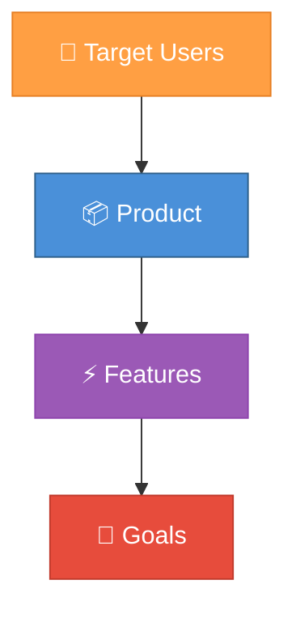

# Flux d'appel au LLM - Analyse détaillée

## Schéma du flux

```mermaid
flowchart TD
    A[👤 User colle PVB JSON] --> B{Validation JSON}
    B -->|Valid| C[Construction du Prompt Initial]
    B -->|Invalid| Z[Erreur affichée]

    C --> D[SYSTEM_PROMPT<br/>+<br/>PVB JSON complet<br/>+<br/>Instructions]

    D --> E[Formatage Mistral<br/>&lt;s&gt;[INST] ... [/INST]]

    E --> F[Appel MLX Generate<br/>temp=0.2, max_tokens=4000]

    F --> G[Réponse LLM]

    G --> H{Extract Mermaid}

    H -->|Trouvé| I[Affichage diagramme à droite]
    H -->|Pas trouvé| J[Message d'erreur]

    I --> K[User demande modification]
    K --> L[REFINEMENT_PROMPT<br/>Current diagram<br/>+<br/>PVB data<br/>+<br/>User feedback]

    L --> E

    style C fill:#4A90D9,stroke:#2E5F8A,color:#fff
    style D fill:#FF9F43,stroke:#E67E22,color:#fff
    style F fill:#50C878,stroke:#2E8B57,color:#fff
    style L fill:#9B59B6,stroke:#8E44AD,color:#fff
```

## Prompt Initial Exact

Quand l'utilisateur colle un PVB JSON, voici le prompt **EXACT** envoyé au LLM:

```
You are an expert at creating Mermaid process flow diagrams from Product Vision Board data.

Your role:
1. Analyze Product Vision Board JSON structure
2. Generate clear, professional Mermaid flowchart diagrams
3. Represent logical flow: Users → Product → Features → Goals
4. Use visual distinction (colors, icons, subgraphs)
5. ALWAYS wrap Mermaid code in ```mermaid``` blocks

Mermaid Best Practices:
- Use flowchart TD (top-down) or LR (left-right) based on user preference
- Add emojis for visual clarity (🖥️ System, 🤖 AI, 👤 Human, 📊 Data, 🎯 Goals, etc.)
- Use subgraphs to group related items
- Apply colors: style NodeName fill:#color,stroke:#color2,color:#fff
- Keep labels concise and business-friendly

Color Palette Guidelines:
- Users/Human: #FF9F43 (orange)
- Systems: #4A90D9 (blue)
- AI/Automation: #50C878 (green)
- Goals/KPIs: #E74C3C (red)
- Features: #9B59B6 (purple)

Example output:

```mermaid
flowchart TD
    A[👥 Target Users] --> B[📦 Product]
    B --> C[⚡ Features]
    C --> D[🎯 Goals]

    style A fill:#FF9F43,stroke:#E67E22,color:#fff
    style B fill:#4A90D9,stroke:#2E5F8A,color:#fff
    style C fill:#9B59B6,stroke:#8E44AD,color:#fff
    style D fill:#E74C3C,stroke:#C0392B,color:#fff
```

CRITICAL: Always respond with valid Mermaid syntax in code blocks.

Generate a Mermaid flowchart diagram from this Product Vision Board:

{
  "1. Utilisateur Cible": [
    "Community manager (utilisateur principal)",
    "Lead buyers (par famille de produit)"
  ],
  "2. Description du Produit": [
    "Extraction automatique des fournisseurs de rang n à partir des devis et contrats",
    "Décomposition automatisée des montants de commande selon les catégories de coûts"
  ],
  "3. Fonctionnalités Clés": [
    "Reconstituer les volumes d'affaires réalisés avec les fournisseurs de rang n",
    "Identifier automatiquement les montants éligibles aux RFA/BFA"
  ],
  "4. Enjeux et Indicateurs": [
    "Atteindre 30M€ de récupération sur les RFA/BFA",
    "Réduire le temps d'enrichissement manuel des données de marché"
  ],
  "Summary": "Faciliter l'identification et la maximisation des remises de fin d'année"
}

Instructions:
1. Start with target users (section 1 "Utilisateur Cible")
2. Flow through product description (section 2 "Description du Produit")
3. Include key features (section 3 "Fonctionnalités Clés")
4. End with objectives/KPIs (section 4 "Enjeux et Indicateurs")
5. Use subgraphs to organize sections logically
6. Add colors to distinguish different types of elements (follow the color palette guidelines)
7. Include relevant emojis for visual clarity
8. Make the flow logical and easy to follow
9. Create a professional, clean diagram suitable for business presentations

Respond with the Mermaid diagram in ```mermaid``` code blocks.
```

## Format Mistral Instruct

Ce prompt est ensuite formaté pour Mistral:

```
<s>[INST] {PROMPT CI-DESSUS} [/INST]
```

## Paramètres MLX

```python
generate(
    model,
    tokenizer,
    prompt=formatted_prompt,
    max_tokens=4000,          # Longueur max de la réponse
    sampler=make_sampler(
        temp=0.2              # Température basse pour cohérence
    ),
    verbose=False
)
```

## Problème Identifié

Le prompt actuel a plusieurs faiblesses:

1. **Trop générique**: "Represent logical flow: Users → Product → Features → Goals"
   - Ne donne pas d'exemples de **processus métier**
   - Se concentre sur la structure PVB plutôt que sur le **flux opérationnel**

2. **Exemple simpliste**: L'exemple montré est juste une cascade simple
   - Pas de branchements conditionnels
   - Pas de boucles ou retours en arrière
   - Pas de parallélisation de tâches

3. **Pas de guidance sur les PROCESSUS**:
   - Le prompt ne dit pas de créer un diagramme de **processus métier**
   - Il manque des exemples de swimlanes, décisions, acteurs

4. **Instructions contradictoires**:
   - "Flow through" suggère une séquence linéaire
   - Mais un bon processus a des décisions, alternatives, validations

## Ce qu'il faudrait améliorer

Pour obtenir un vrai **diagramme de processus** comme dans votre exemple Claude Desktop:

1. **Exemples concrets de processus** dans le prompt
2. **Guidance sur les décisions** (losanges `{}`)
3. **Guidance sur les acteurs** (swimlanes ou couleurs par rôle)
4. **Guidance sur les flux conditionnels**
5. **Référence explicite** à votre conversation Claude Desktop comme modèle

Voulez-vous que je réécrive les prompts pour générer de vrais diagrammes de processus métier ?
