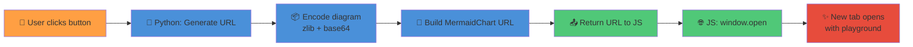

# MermaidChart.com Integration

## Fonctionnalité

Le bouton **"🔗 Open in Mermaid Chart"** permet d'ouvrir le diagramme actuel dans le playground MermaidChart.com dans un nouvel onglet.

## Comment ça fonctionne

### 1. Encodage du diagramme

Le diagramme Mermaid est encodé en utilisant :
- **Compression zlib** (compatible pako)
- **Encodage base64** (URL-safe)

```python
# src/pvb_flow/core/mermaid_encoder.py
def encode_mermaid_for_url(mermaid_code: str) -> str:
    mermaid_bytes = mermaid_code.encode('utf-8')
    compressed = zlib.compress(mermaid_bytes, level=9)
    encoded = base64.urlsafe_b64encode(compressed).decode('ascii')
    return encoded
```

### 2. Génération de l'URL

L'URL MermaidChart.com est construite avec le format :

```
https://www.mermaidchart.com/play?utm_source=pvb_flow&utm_medium=gradio_app#pako:{encoded_diagram}
```

### 3. Ouverture automatique

Le bouton utilise un handler JavaScript pour ouvrir automatiquement l'URL dans un nouvel onglet :

```javascript
// Gradio JS handler
(url) => {
    if (url && url.trim() !== '') {
        window.open(url, '_blank');  // Ouvre dans un nouvel onglet
    } else {
        alert('⚠️ No diagram to share. Please generate a diagram first.');
    }
}
```

## Flux complet



## Ce que l'utilisateur peut faire sur MermaidChart.com

Une fois le playground ouvert, l'utilisateur peut :

1. **Visualiser** le diagramme rendu
2. **Éditer** le code Mermaid en temps réel
3. **Exporter** le diagramme :
   - PNG (image raster)
   - SVG (image vectorielle)
   - PDF (document)
4. **Partager** l'URL avec d'autres personnes
5. **Sauvegarder** le diagramme dans son compte MermaidChart (si connecté)

## Exemples d'URL générées

### Diagramme simple
```
https://www.mermaidchart.com/play#pako:eNpLy8kvT85ILCpRCHHhUgACx-jgEiA3VkFX107BqdolNTmzODM_rxYs6QQSrYlMLa5RcI52TC4BSigYxiJJ-eXXKLjAZIwgMs5go1yjXfNSIAIuEAEAuBIhdA==
```
**Longueur**: ~180 caractères

### Diagramme complexe (avec légende, acteurs, décisions)
```
https://www.mermaidchart.com/play#pako:eNqdk7tu2zAUhnc_BSGvCRzLcX1BkUJXO4CHojG6GBkYmbKJ0qRDUmiNJEPWLkUQIEC7ZEmBaO_QXW_SF2geoSTli1wHaFROvw7Pd65UTNjHaAq5BEO_AtQRydmEw_kUDLJ0gugYGas-g_ro6f7u---fX8DJQsjscYZON5e2uny4A8dOwdZQtpsH0E9mENPcriJWtvO85SxCQoyspUgEGCMw5BBLNENUWpuAzqhmPd3ffgYnLOER0n4-ozRLkXh9xmtHwSfJYSQxowBTLDEkyKqdVta8e3FhDRdzDRr_8RIGb6yrq42bVx_pNNfrNoFj3N9laZTMs5RDkyLG0RQjLgoFevbfpPsPco36mlQDdCgkC4HUIHdbihmfmQhbZKBJNeb3kOBxniCfeN5kQLlOJ4SZJlj1XIwQjqxf377qxXqQRAkBTiKZznSe5DGc-ZzgKI_Ns8cJUTObZalUTRTj9HYrCbHqJw_iMSp59oMgcJ4oB5mlRba_2q0Lxe5mj6lyn_BVBalIiIRS6O1uvSoH7O8fAddoV-vLfOF161Ktdcdsa7NdyZdu0Pwn8OzCh290YHRgdGh0aHTP6J7R_eXTlgvVpKPWTEi3euh0DvzOnpCcfUDdqh00w7azFzHCeLcax3EBccsjquzyjF2e8ZdI88Brt9oFpO02W88jwRIJw0542FgjwatWYNvPI2H5wnrls_RfmqXADP5jzgO7_NAGjZf28we4Y8cq
```
**Longueur**: ~1200 caractères

## Tests

Pour tester l'encodage :

```bash
# Test l'encodage et la génération d'URL
python test_mermaid_url.py

# Test l'intégration UI complète
python test_ui_integration.py
```

## Compatibilité

- ✅ Tous les diagrammes Mermaid (flowchart, sequence, class, etc.)
- ✅ Tous les navigateurs modernes (Chrome, Firefox, Safari, Edge)
- ✅ Mobile et desktop
- ✅ Pas de limite de taille pratique (URLs jusqu'à ~2000 caractères supportées par les navigateurs)

## Format pako

Le format `#pako:` est le standard utilisé par MermaidChart.com pour encoder les diagrammes dans les URLs. Il utilise la bibliothèque JavaScript **pako** pour la compression, qui est compatible avec zlib en Python.
