# Amélioration des Prompts - Résumé

## Changements Majeurs

### ❌ AVANT : Prompts Conceptuels

Les anciens prompts demandaient au LLM de créer une **structure conceptuelle**:
- "Represent logical flow: Users → Product → Features → Goals"
- Exemple simple sans processus réel
- Pas de guidance sur les acteurs, décisions, validations

**Résultat**: Diagrammes statiques type "mind map" au lieu de processus opérationnels.

### ✅ MAINTENANT : Prompts Orientés Processus

Les nouveaux prompts demandent au LLM de créer des **processus opérationnels**:

#### 1. SYSTEM_PROMPT Amélioré

**Missions claires**:
```
Transform Product Vision Board data into OPERATIONAL PROCESS DIAGRAMS that show:
- Sequential steps of execution
- Decision points and branching logic
- Different actors (Systems, AI, Humans) and their responsibilities
- Data flows and transformations
- Validation and enrichment loops
```

**Exemple concret** montrant:
- Légende avec types d'acteurs
- Décisions (losanges)
- Flux conditionnels avec labels
- Acteurs différenciés par couleur
- Structure de processus réaliste

**Guidelines d'analyse** pour extraire un processus depuis un PVB:
1. Identifier le workflow opérationnel
2. Identifier les acteurs et leurs rôles
3. Trouver les points de décision
4. Structurer le flux (début, milieu, fin)
5. Ajouter le contexte métier

#### 2. Prompt Initial Restructuré

**Guide étape par étape**:
```
ANALYSIS STEPS:

1. Extract the operational workflow from "Description du Produit"
   - What steps are described or implied?
   - What is the sequence of operations?

2. Identify actors and their roles
   - Who are the human actors? (→ Orange boxes 👤)
   - What systems are involved? (→ Blue boxes 🖥️)
   - Is there AI/automation? (→ Green boxes 🤖)

3. Find decision points and validations
   - Are there conditional branches? (Use diamond shapes {})
   - Are there validation/approval steps?

4. Structure the complete process
   - START: Data source, trigger, or input
   - MIDDLE: All processing steps in logical order
   - END: Result storage or output

5. Add business intelligence from "Fonctionnalités Clés"
```

**Requirements clairs**:
- ✓ Utiliser flowchart TD (vertical)
- ✓ Créer une légende
- ✓ Utiliser des losanges {} pour les décisions
- ✓ Colorer par type d'acteur
- ✓ Labeller les flèches conditionnelles

**Instruction finale importante**:
```
Think like a business analyst: what would the real operational process look like?
```

#### 3. Prompt de Refinement Amélioré

**Structuré par type de modification**:

**Layout**: vertical, horizontal, compact, aéré
**Visual**: couleurs, icônes, taille, légende
**Content**: détails, simplification, ajout/suppression
**Process logic**: décisions, validations, acteurs, boucles

Chaque type avec exemples en **français et anglais**.

## Comparaison Concrète

### Ancien Prompt (Problème)
```
Your role:
1. Analyze Product Vision Board JSON structure
2. Generate clear, professional Mermaid flowchart diagrams
3. Represent logical flow: Users → Product → Features → Goals
```

➡️ **Trop vague, focus sur la structure du PVB**

### Nouveau Prompt (Solution)
```
Your mission:
Transform Product Vision Board data into OPERATIONAL PROCESS DIAGRAMS that show:
- Sequential steps of execution
- Decision points and branching logic
- Different actors (Systems, AI, Humans) and their responsibilities
```

➡️ **Précis, focus sur le processus opérationnel**

## Exemple de Résultat Attendu

Avec les nouveaux prompts, pour votre PVB sur les RFA/BFA, le LLM devrait générer:

```mermaid
flowchart TD
    subgraph Légende
        L1[🖥️ Système]
        L2[🤖 IA]
        L3[👤 Humain]
    end

    subgraph Process["Récupération RFA/BFA Fournisseurs Rang N"]
        A[/"📊 Patrimoine Achats<br/>Contrats & Commandes année N"/]

        B{"Type de<br/>document ?"}

        C1["📁 SharePoint Constellation<br/>Récupération PJ"]
        C2["📁 HAPlus<br/>Récupération PJ"]

        D["🤖 Analyse IA<br/>Extraction fournisseurs<br/>+ montants"]

        E["👤 Community Manager<br/>Validation/Enrichissement<br/>fournisseurs"]

        F["⚙️ Règle de Calcul<br/>Ventilation montants"]

        F1["Matière première"]
        F2["Transport/Logistique"]
        F3["Mise en œuvre"]

        G["👤 Community Manager<br/>Validation/Enrichissement<br/>ventilation"]

        H[/"📊 Patrimoine Achats<br/>Données enrichies"/]
    end

    A --> B
    B -->|"Contrat"| C1
    B -->|"Commande"| C2
    C1 --> D
    C2 --> D
    D --> E
    E --> F
    F --> F1 & F2 & F3
    F1 & F2 & F3 --> G
    G --> H

    style A fill:#4A90D9,stroke:#2E5F8A,color:#fff
    style B fill:#4A90D9,stroke:#2E5F8A,color:#fff
    style C1 fill:#4A90D9,stroke:#2E5F8A,color:#fff
    style C2 fill:#4A90D9,stroke:#2E5F8A,color:#fff
    style D fill:#50C878,stroke:#2E8B57,color:#fff
    style E fill:#FF9F43,stroke:#E67E22,color:#fff
    style F fill:#4A90D9,stroke:#2E5F8A,color:#fff
    style G fill:#FF9F43,stroke:#E67E22,color:#fff
    style H fill:#4A90D9,stroke:#2E5F8A,color:#fff
```



## Prochaines Étapes

1. **Tester** avec votre PVB réel
2. **Itérer** si besoin avec des raffinements:
   - "plus vertical"
   - "ajouter plus d'étapes de validation"
   - "séparer les acteurs plus clairement"
   - etc.

3. **Ajuster** les prompts si le LLM ne comprend pas certains aspects de vos PVB spécifiques

## Points Clés du Succès

✅ Le LLM comprend maintenant qu'il doit créer un **PROCESSUS** et non une **STRUCTURE**
✅ Instructions claires pour analyser le PVB et en extraire les étapes opérationnelles
✅ Exemples concrets de ce qu'on attend
✅ Distinction claire des acteurs (humain, système, IA)
✅ Support des décisions et branchements
✅ Prompts de refinement alignés avec la nouvelle approche
